# Using Cloudera Docker to Test Kerberos

## Getting Started -Installing Docker

[Install Docker on your workstation](https://www.docker.com/products/docker-desktop)

Validate Installation

```text
docker version
```

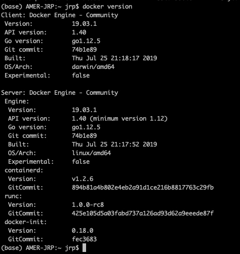

## Getting Started - Starting Cloudera Quickstart Docker 

### Pull Image Cloudera Quick Start

```text
docker pull cloudera/quickstart:latest
```

Please take  a look at Docker Hub for Cloudera Quickstart [here](https://hub.docker.com/r/cloudera/quickstart)

```text
docker images
```


Make modification to Docker to Run with 8CPU\(Minimum 4\) and 8 GB of Memory

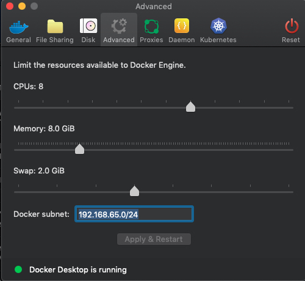

Execute the Docker Image by Running following Command 

```text
docker run  --name qst.cdh --hostname=quickstart.cloudera --privileged=true -ti -d -v /Users/jrp/Documents/Cloudera:/src --publish-all=true -p 8888:8888   -p 80:80 -p 7180:7180 -p 10000:10000 -p 21050:21050 cloudera/quickstart /usr/bin/docker-quickstart
```

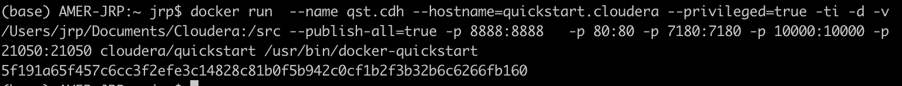

> docker run --name qst.cdh --hostname=quickstart.cloudera --privileged=true -ti -d -v /Users/jrp/Documents/Cloudera:/src --publish-all=true -p 8888:8888 -p 80:80 -p 7180:7180 -p 10000:10000 -p 21050:21050 cloudera/quickstart /usr/bin/docker-quickstart

* To run an image with the hostname of `quickstart.cloudera` 
* `/usr/bin/docker-quickstart` \#Entry point to start all CDH services. Provided by cloudera
* `--hostname=quickstart.cloudera` \#Required: pseudo-distributed configuration assumes this hostname
* `--name =qst.cdh` force docker to name the container for easy recognition
* `--privileged=true` \#Required: for HBase, MySQL-backed Hive metastore, Hue, Oozie, Sentry, and Cloudera Manager, and possibly others
* `-t` \#Required: once services are started, a Bash shell takes over and will die without this
* `-i` \#Required: if you want to use the terminal, either immediately or attach later
* `-v` allows me to share volumes with the container, so anything that I put in the `/Users/jrp/Documents/Cloudera` directory, will show up in the Docker container under the `/src` directory
* `-d`  \#Optional: runs the container in the background. I would recommend to use this option if you planning to run container constantly on background.
* `--publish-all=true` opens up all the host ports to the docker ports, so you can access stuff like the Cloudera manager, HUE, Hive, Impala and etc
* `-p 8888` \#Recommended: maps the Hue port in the guest to another port on the host
* `-p 7180` \#Recommended: maps the Cloudera Manager port in the guest \(7180\) to another port on the 
* `-p 80, -p21050, -p10000` needed for Tutorial, Impala and Hive
* Available Ports
  * 8888 [Hue](http://quickstart.cloudera:8888/)
  * 7180 [Cloudera Manager](http://quickstart.cloudera:7180/)
  * 80 [Tutorial](http://quickstart.cloudera/)
  * 8983 [SolR](http://quickstart.cloudera:8983/solr)
  * 8088 [Hadoop MapReduce UI](http://quickstart.cloudera:8088/)
  * 11000 [Oozie](http://quickstart.cloudera:11000/)
  * 9092 Kafka
  * 2181 Zookeeper
  * 10000 Hive \(Thrift\)
  * 21050 Impala Thrift

Validate Docker running by executing 

```text
docker ps
```

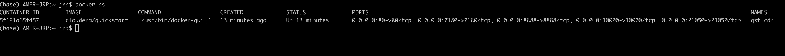

Inspect the Docker Network by typing 

```text
docker inspect qst.cdh
```

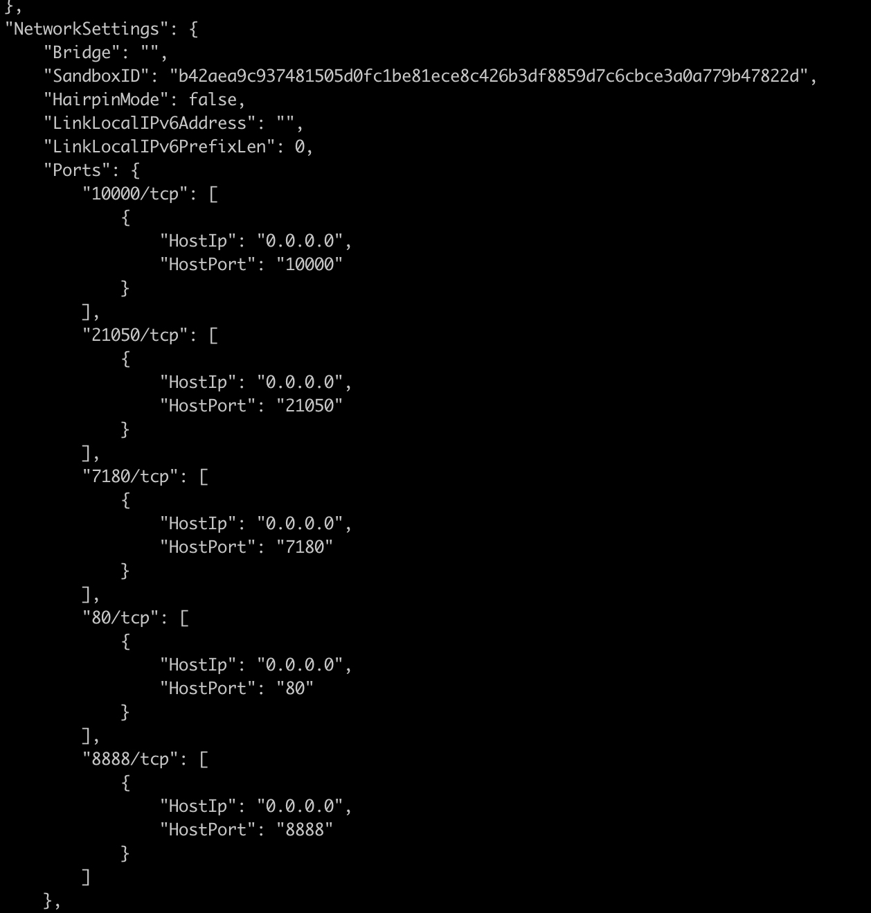

### Starting Cloudera Manager

Multiple ways to do this but I will run _**docker exec**_ you can also attach to the docker image using _**docker attach**_

```text
docker exec -ti qst.cdh  /home/cloudera/cloudera-manager --express
```

You can also execute

`docker attach qst.cdh`  and run script to enable cloudera manager: `/home/cloudera/cloudera-manager --express`

> First service it tries to start is Kafka but since we do not have Kafka enabled we will need to wait 30 to 45 seconds for CDH services to start

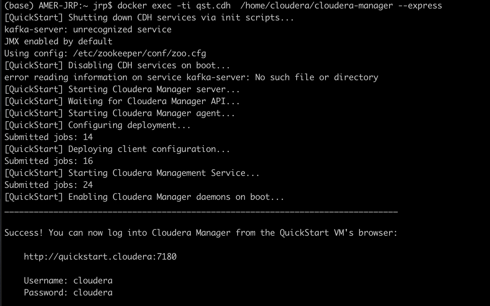

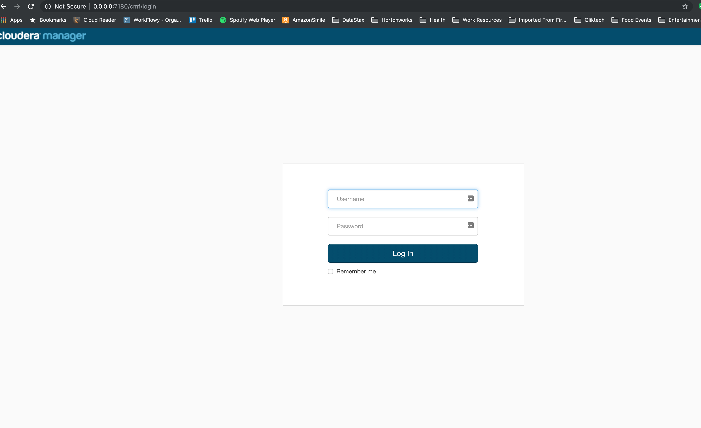

use Clouder/Cloudera to log in

First thing you will see is the Server is not working and stopped due to Clock Offset issues

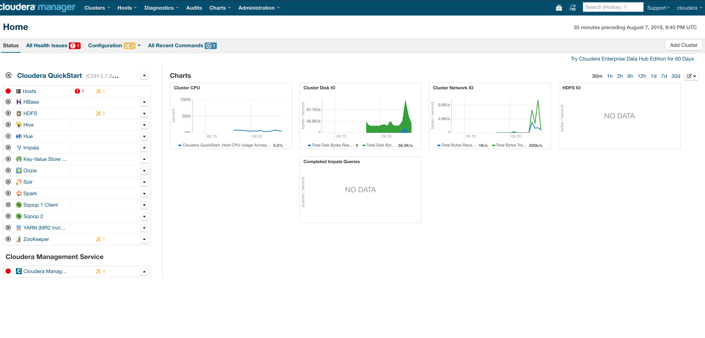

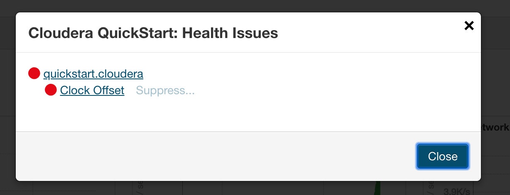

This can be resolved with following command

`docker -ti qst.cdh /etc/init.d/ntpd stop` and  `docker -ti qst.cdh etc/init.d/ntpd start` 

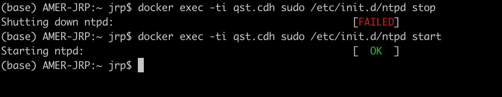

Validate Cloudera Manager Shows Cluster Health Green

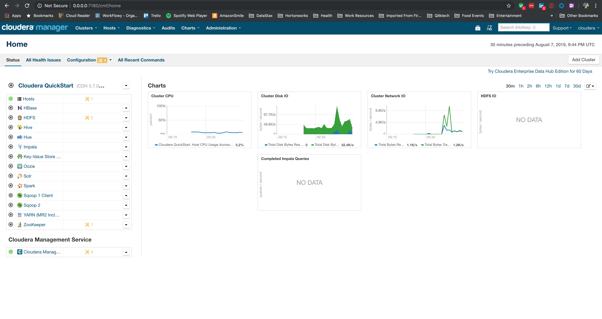

Restart Cloudera Quickstart Services using 

```text
curl -X POST -u "admin:admin" -i http://localhost:7180/api/v18/clusters/Cloudera%20QuickStart/commands/start
```

or using the GUI

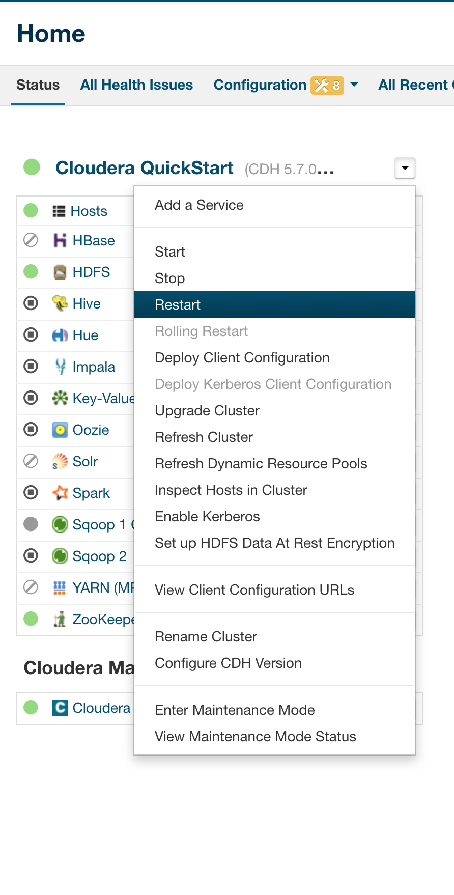

Load some Data to your Cluster using HUE and you are ready to test.

For this exercise I used data from ourairports.com.  Please take a [look](http://ourairports.com/data/)

### At this point you are ready to start setting up with your test

## Validating Qlik Sense with Hive and Impala

On Cloudera Manager Use Hue or Hive to Import a CSV into Hive and Impala

## Setting up Kerberos

## Validating Qlik Sense with Kerberos Enabled Hive and Impala

## Other Information

Stopping Docker Image

```text
docker stop --time 60 qst.cdh
```

If for accident your container is stopped 

```text
docker restart qst.cdh
```

force Cloudera Manager to restart 

```text
docker exec -ti qst.cdh  /home/cloudera/cloudera-manager --express --force
```

**Tip** To Stop all running/dangling Docker Images 

```text
 docker stop --time=60 $(docker ps -a)
```

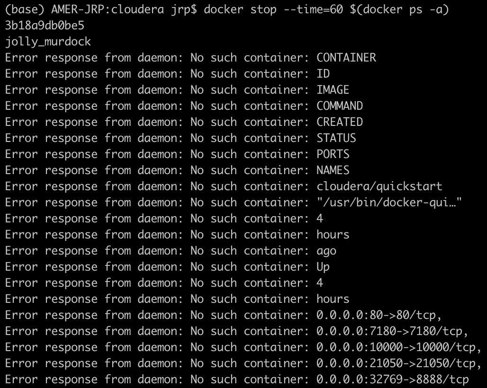

Cleaning up Docker 

```text
docker system prune
```

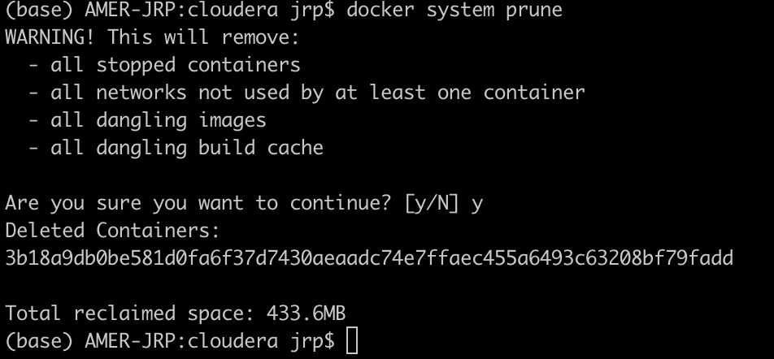

